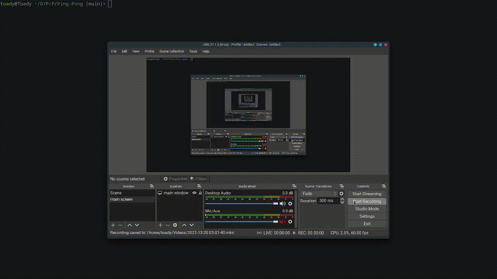

# Ping-Pong

### Note: the game is not as slow as observed in the video below, it got messed up during conversion to gif format

## About

This is a ping pong game against a pseudo AI enemy 
The player is has to try and bounce back the ball as many times from its paddle

## Controls and Objectives

1. The player moves up on `up arrow` press
2. The player moves down on `down arrow` press
2. Enemies move towards the ball
3. The player must bounce back the ball from its paddle

## Installation

1. do `$ git clone https://github.com/Reverend-Toady/Ping-Pong.git` if you have git installed
2. download the zip files if you don't have git installed

## Usage

1. run `$ ./output/main` from the `ping-pong` directory

## TODO

1. Add points
2. Display text "you lose" when ball goes out of bounds (currently no bounds)
3. Add replay option
